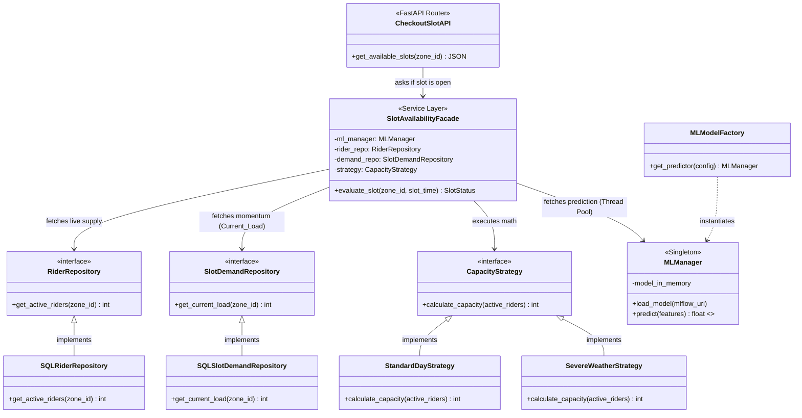

# Hyperlocal Delivery Slot Prediction & Rule Engine

## 📖 Project Overview
This project is an end-to-end Machine Learning system designed for hyperlocal delivery platforms (e.g., Zepto, Blinkit, Instacart). It proactively prevents **"Delivery Collisions"**—scenarios where the number of customer orders exceeds the physical capacity of active delivery riders in a specific zone.

The system powers a **Customer Checkout UI**. When a user attempts to select a delivery time slot (e.g., 8:00 PM), the backend dynamically calculates if the slot should be available or grayed out based on an AI-driven prediction of upcoming demand versus live mathematical capacity.

---

## 🛠️ Tech Stack
* **Machine Learning:** XGBoost, Scikit-learn, Pandas
* **MLOps Pipeline:** MLflow (Model Registry & Tracking), DVC (Data Version Control)
* **Backend** FastAPI, Pydantic, Python 3
* **Frontend** React , JavaScript
* **Database & ORM:** PostgreSql , SQLAlchemy
* **Dependency Management:** `uv`

---

## 🧠 Core Business Logic (The Math)
The decision to block or open a checkout slot is determined by comparing two distinct metrics:

1. **Live Capacity (Supply):** Calculated via a Strategy Pattern.
   * `Standard Math:` Active Riders × 2.0 (orders per hour).
   * `Severe Weather Math:` Active Riders × 1.2 (riders are slower in rain).
2. **Predicted Demand (Demand):** Predicted instantly by an XGBoost Regression model. The model analyzes time (Hour Sine/Cosine), weather severity, festivals, traffic, and the current momentum of early bookings (`Current_Load`).

**The Rule:** If `Predicted Demand > Live Capacity`, the slot is full and the API returns `{"is_available": false}`.

---

## 🏗️ Backend Architecture (Clean Architecture)

The FastAPI backend is built with Enterprise-grade High-Level Design (HLD) and Low-Level Design (LLD) patterns to ensure high concurrency and maintainability.

### Key Architectural Patterns:
1. **Facade Pattern (`SlotAvailabilityFacade`):** The orchestrator. It fetches live riders from the Database Repository, momentum from the Demand Repository, runs the Strategy math, and queries the ML model.
2. **Repository Pattern:** Isolates all SQLAlchemy database logic. Allows for fast mock-testing and future database swaps (e.g., SQLite to PostgreSQL) without touching the core ML logic.
3. **Strategy Pattern (`CapacityStrategy`):** Encapsulates the math rules for capacity. Allows dynamic mathematical multipliers based on weather conditions without bloated `if/else` logic.
4. **Singleton Pattern (`MLManager`):** Guarantees the heavy 100MB+ XGBoost model is loaded into server RAM exactly **once** upon boot, sharing the instance across all concurrent web requests.
5. **Thread Pool Offloading:** `model.predict()` is a CPU-bound blocking operation. The `MLManager` explicitly offloads inference to an external Thread Pool to prevent Python's Global Interpreter Lock (GIL) from freezing the async FastAPI event loop.

### UML Class Diagram

---

## 🚀 End-to-End Walkthrough
1. **Frontend UI** (Customer Checkout Page) asks `CheckoutSlotAPI` for available time slots in Zone 4.
2. `CheckoutSlotAPI` hands Zone 4 and the timeslot (e.g., 8:00 PM) to the `SlotAvailabilityFacade`.
3. `SlotAvailabilityFacade` asks `SQLRiderRepository` for active riders. (Result: **50 riders**)
4. `SlotAvailabilityFacade` asks `SQLSlotDemandRepository` for current early bookings. (Result: **20 bookings**)
5. `SlotAvailabilityFacade` selects the `StandardDayStrategy`.
6. `SlotAvailabilityFacade` asks the Strategy for capacity. (Math: 50 riders * 2 = **100 Capacity**).
7. `SlotAvailabilityFacade` hands the 20 bookings and time data to the `MLManager`.
8. `MLManager` offloads the math to a background CPU thread and runs XGBoost. (Prediction: **115 Demand**).
9. `SlotAvailabilityFacade` compares them: **115 Demand > 100 Capacity**. The slot is mathematically full!
10. `SlotAvailabilityFacade` returns `False` to the API.
11. `CheckoutSlotAPI` returns `{"slot": "20:00", "is_available": false}` to the Frontend.
12. The React Frontend renders the 8:00 PM button as **grayed out and disabled** so the user must pick a different time.

---

## 🖥️ Admin Dashboard UI (Simulation & Monitoring)
The project includes an Admin Dashboard to visualize the backend ML predictions and provide manual override controls.

### Proposed Components:
1. **Delivery Collision Forecast (Bar Chart):**
   * **6-Hour Lookahead:** Displays a rolling 6-hour forecast for a selected zone.
   * **Demand vs. Capacity:** A bar chart showing predicted demand (Orders/Hr) against a horizontal dotted line representing the zone's `MAX CAPACITY`.
   * **Visual Alerts:** Bars that breach the capacity line dynamically change color (e.g., Green to Red) to visually highlight a "Collision" status.
2. **Congested Zone Heatmap:**
   * A spatial map (or grid) of all delivery zones. Zones currently experiencing or forecasting a collision are highlighted in red (Congested), providing a bird's-eye view of city-wide health.
3. **Manual Override Controls ("God Mode"):**
   * **Force Close Toggle:** Instantly overrides the ML model to gray out a specific delivery slot in case of an emergency.
   * **Dynamic Rebalancing (Surge Riders):** An input to simulate "pulling in" emergency riders from a neighboring zone, artificially boosting live capacity to re-open a grayed-out slot.
4. **Platform Configuration:**
   * Controls for admins to define or adjust the fixed time windows (e.g., modifying `08:00 - 09:00` shifts) for different regions.
5. **Continuous Training (MLOps) Trigger:**
   * A **"Retrain Model"** action button. In a production MLOps pipeline, this triggers a background script to pull the latest 3-6 months of real transaction data (rolling window) and retrain the XGBoost model. This prevents "model drift" by adapting to new consumer trends, automatically registering the new version in MLflow.
