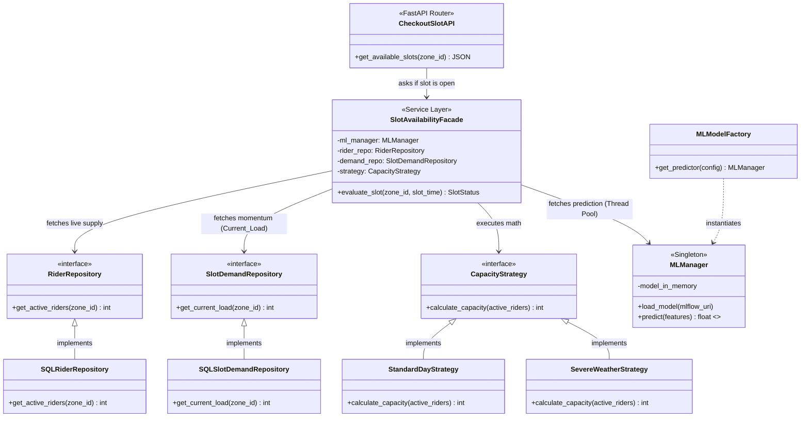

# Delivery Slot Prediction - Backend Architecture

The backend of the Delivery Slot Prediction system follows Clean Architecture principles, isolating the HTTP routing, business logic, data access, and ML predictions. It is designed specifically to serve a **Customer Checkout UI**, determining in real-time whether a specific delivery slot should be available or grayed out.

## UML Class Diagram (Design Patterns)

---

## Detailed Component Breakdown & Checkout UI Walkthrough

### 1. CheckoutSlotAPI (The Doorman)
* **Role**: Handles the incoming HTTP web requests from the React Frontend Checkout Page.
* **Architecture Rule**: It knows absolutely nothing about databases, machine learning, or complex math. Its only job is to receive a request like `GET /slots?zone_id=4`, pass it to the Facade, and return the JSON response to the UI.

### 2. SlotAvailabilityFacade (The Orchestrator)
* **Role**: The core conductor of the workflow (Service Layer).
* **Architecture Rule**: It coordinates all other components. It asks the Repositories for data, the Strategy for math, and the MLManager for predictions.
* **Example**: "Hey RiderRepo, give me active riders. Hey DemandRepo, give me early bookings. Hey MLManager, predict the future. Hey Strategy, are we at capacity? If yes, I will tell the API to return `is_available: false`."

### 3. Repositories (The Data Fetchers)
* **Components**: `RiderRepository`, `SlotDemandRepository`
* **Role**: Hides the messy SQLAlchemy database code behind clean interfaces.
* **Architecture Rule**: The Facade should never write SQL queries directly. By using repositories, we can instantly swap from SQLite to PostgreSQL, or write fast mock tests.

### 4. CapacityStrategy (The Math Rules)
* **Role**: Houses the business logic for calculating live capacity based on active riders.
* **Architecture Rule**: Avoids massive `if/else` statements in the Facade.
* **Example**: 
  * `StandardDayStrategy`: `capacity = riders * 2.0`
  * `SevereWeatherStrategy`: `capacity = riders * 1.2` (Rain slows them down)
  The Facade just calls `.calculate_capacity()` and the active strategy handles the multiplier automatically based on the weather feature.

### 5. MLManager & MLModelFactory (The AI Layer)
* **MLManager (Singleton)**: XGBoost models are heavy. The Singleton guarantees the 100MB model is loaded into server RAM exactly **once** upon boot. All web requests share this single instance to prevent crashing.
* **GIL Thread Pool Offloading**: Because `model.predict()` is a CPU-bound math operation, executing it blocks Python's Global Interpreter Lock (GIL). The MLManager explicitly offloads this math to an external CPU Thread Pool so the async web server remains blazing fast for other users checking out.
* **MLModelFactory**: Decides whether to instantiate an XGBoost manager or a deep learning manager based on backend config.

---

### Example End-to-End Checkout Walkthrough
1. **Frontend UI** (Customer Checkout Page) asks `CheckoutSlotAPI` for available time slots in Zone 4.
2. `CheckoutSlotAPI` hands Zone 4 and the timeslot (e.g., 8:00 PM) to the `SlotAvailabilityFacade`.
3. `SlotAvailabilityFacade` asks `SQLRiderRepository` for active riders. (Result: **50 riders**)
4. `SlotAvailabilityFacade` asks `SQLSlotDemandRepository` for current early bookings. (Result: **20 bookings**)
5. `SlotAvailabilityFacade` selects the `StandardDayStrategy`.
6. `SlotAvailabilityFacade` asks the Strategy for capacity. (Math: 50 riders * 2 = **100 Capacity**).
7. `SlotAvailabilityFacade` hands the 20 bookings and time data to the `MLManager`.
8. `MLManager` offloads the math to a background CPU thread and runs XGBoost. (Prediction: **115 Demand**).
9. `SlotAvailabilityFacade` compares them: **115 Demand > 100 Capacity**. The slot is mathematically full!
10. `SlotAvailabilityFacade` returns `False` to the API.
11. `CheckoutSlotAPI` returns `{"slot": "20:00", "is_available": false}` to the Frontend.
12. The React Frontend renders the 8:00 PM button as **grayed out and disabled** so the user must pick a different time.
